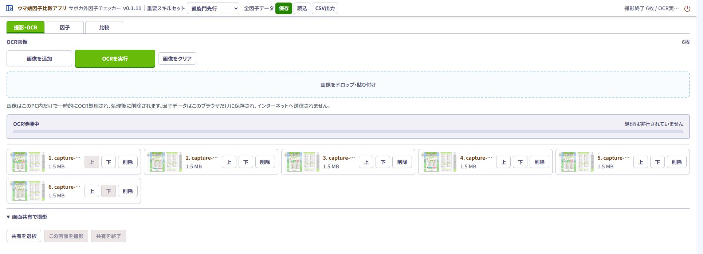
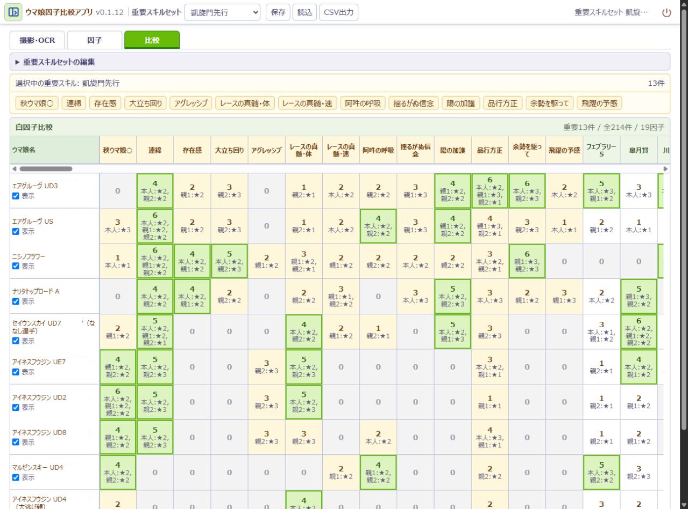

# ウマ娘因子比較アプリ　サポカ外因子チェッカー

**本育成サポカ外で欲しい白因子が、選択した継承ウマ娘に何面あるか横並びで確認できるアプリです。**

## v0.1.12

継承ウマ娘の因子画像をOCRで読み取り、因子を保存・比較するWindows向けローカルアプリです。

本アプリは非公式ツールです。ゲーム本体、Cygames、その他の権利者とは関係ありません。

## 画面

### 画像を追加してOCR

因子画像を追加し、利用者が「OCRを実行」を押すと、青・赤・緑・白因子を読み取ります。OCR結果は画面上で確認・修正できます。

### 欲しい白因子を横並びで比較

読み取って保存した継承ウマ娘から、重要スキルに登録した白因子の面数と、本人・親1・親2の内訳を一覧で確認できます。

※比較画面の広報用画像では評価点を非表示にしています。実際の画面には表示されます。

## ダウンロード

[GitHub Releases](https://github.com/abu732/uma-musume-factor-comparison-app/releases/latest)から、次のファイルをダウンロードしてください。

- `UmaFactor-win-x64-portable-v0.1.12.zip`

同じReleaseにある`SHA256SUMS.txt`で、ダウンロードしたZIPのSHA-256を確認できます。

## 使い方

1. ZIPを右クリックし、Windows標準の「すべて展開」を選びます。
2. 展開先の`Uma`フォルダーを開きます。
3. `サポカ外因子チェッカーを起動.cmd`をダブルクリックします。
4. ブラウザで画像を選び、OCRを実行します。
5. 保存した因子セットを選び、「比較」タブで白因子を比較します。
6. 終了時は画面の終了操作、または`アプリを終了.cmd`を使用します。

インストール、管理者権限、PythonやOCRエンジンの別途導入は不要です。OCRは同梱モデルを使ってPC内で実行され、選択した画像やOCR結果を外部サービスへ送信しません。

詳しい手順と注意事項は、Releaseに添付した`README-FIRST.txt`と`PORTABLE-GUIDE.txt`を確認してください。

## v0.1.12の主な変更

- Windowsで読みやすい日本語書体と文字サイズへ調整しました。
- 比較表のウマ娘名列と白因子列の幅を見直し、同じ画面幅でより多くの白因子を確認できるようにしました。
- 白因子比較の見出しや表の配色を自然な緑系へ統一しました。
- 「全因子データ」の保存ボタンが常時強調されないよう表示を整理しました。

## 因子データの保存

画面上部の「全因子データ」にある「保存」では、`Uma\因子データ`へ再読込可能なJSONバックアップを保存します。「CSV出力」では1因子1行のCSV一覧を同じ場所へ保存します。CSVはUTF-8 BOM付きで、Excelなどの表計算ソフトで確認できますが、アプリへの読込には対応していません。新しい版を別フォルダーへ展開した場合は、「読込」から旧版のJSONを選択できます。

展開した`Uma`フォルダーを削除すると、その中の`因子データ`も削除されます。JSONやCSVを残す場合は、削除前にドキュメントなど別の場所へコピーしてください。

## 対応環境と警告

- Windows 10／11（64bit）
- 画面表示にはMicrosoft EdgeまたはGoogle Chromeを使用
- インターネット接続なしでOCR可能

本アプリはコード署名していないため、Windowsの警告には「不明な発行元」と表示されます。本リポジトリのGitHub Releasesから取得し、ファイル名とSHA-256が同じReleaseの案内と一致していれば、警告内容を確認したうえで実行できます。Windows DefenderやSmartScreenは無効にしないでください。

アプリ本体の終了後もブラウザタブが残る場合があります。その場合、ブラウザの閉じるボタンでタブを閉じて問題ありません。作業データを削除する場合は`アプリの作業データを削除.cmd`を実行し、不要になった展開フォルダーを削除してください。

## ライセンスと利用条件

本アプリは、プロプライエタリです。利用・再配布などの条件は[LICENSE.txt](LICENSE.txt)を確認してください。

第三者ソフトウェアのライセンスは[THIRD_PARTY_NOTICES.md](THIRD_PARTY_NOTICES.md)に記載しています。

「ウマ娘 プリティーダービー」に関する権利は各権利者に帰属します。利用にあたっては、[「ウマ娘 プリティーダービー」二次創作ガイドライン](https://umamusume.jp/derivativework_guidelines/)も確認してください。
