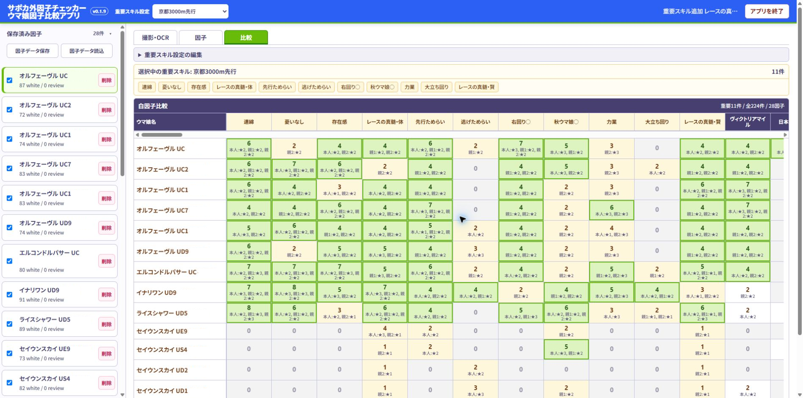

# サポカ外因子チェッカー / Support Card Gap Checker

**本育成サポカ外で欲しい白因子が、選択した継承ウマ娘に何面あるか横並びで確認できる**

日本語DMM版とSteam English版は、対応画像・ポート・保存データが完全に分かれた別エディションです。データの変換、共有、相互比較には対応しません。

## 日本語DMM版 v0.1.9

育成ウマ娘の因子画像をOCRで読み取り、因子を保存・比較するWindows向けローカルアプリです。

本アプリは非公式ツールです。ゲーム本体、Cygames、その他の権利者とは関係ありません。

## ダウンロード

[GitHub Releases](https://github.com/abu732/uma-musume-factor-comparison-app/releases/latest)から、次のファイルをダウンロードしてください。

- `UmaFactor-win-x64-portable-v0.1.9.zip`

同じReleaseにある`SHA256SUMS.txt`で、ダウンロードしたZIPのSHA-256を確認できます。

## 使い方

1. ZIPを右クリックし、Windows標準の「すべて展開」を選びます。
2. 展開先の`Uma`フォルダーを開きます。
3. `サポカ外因子チェッカーを起動.cmd`をダブルクリックします。
4. ブラウザで画像を選び、OCRを実行します。
5. 保存した因子セットを選び、「比較」タブで白因子を比較します。
6. 終了時は画面の終了操作、または`アプリを終了.cmd`を使用します。

インストール、管理者権限、PythonやOCRエンジンの別途導入は不要です。OCRは同梱モデルを使ってPC内で実行され、選択した画像やOCR結果を外部サービスへ送信しません。

詳しい手順と注意事項は、Releaseに添付した`README-FIRST.txt`と`PORTABLE-GUIDE.txt`を確認してください。

## v0.1.9の主な変更

- 段階点OCRの信頼度が低い場合や、評価点からの候補と一致しない場合に、因子タブで段階点を確認・修正できるようにしました。
- 重要スキル入力欄から、辞書へ未登録の新規実装スキルも追加できるようにしました。
- 「白因子比較」の横スクロールバーを因子名の見出し直下へ移動しました。
- ボタン名を「因子データ保存」「因子データ読込」へ変更しました。
- 「因子データ保存」で`Uma\因子データ`へ日時入りJSONを直接保存するようにしました。
- 画面最上部に、現在起動しているアプリの版番号を表示するようにしました。
- アプリ名左側の黄色い装飾線を削除しました。
- 更新後に旧版のCSSやJavaScriptが表示されないよう、配布版番号によるキャッシュ対策を追加しました。
- 画面共有で撮影する画像の上限を8枚から12枚へ拡張し、9枚目以降も追加できるようにしました。
- 上限を超えた撮影を「追加済み」と誤表示せず、最大枚数の案内を表示するようにしました。
- Windows日本語環境でOCR出力にCP932外の文字が含まれた場合、処理完了後に失敗となる問題を修正しました。
- 画面上端の青・赤・緑因子を保持し、青因子を判定できない場合も次の赤因子から親1・親2の人物境界を復元するようにしました。
- OCR失敗時に、画像やOCR結果を含まない診断情報を`Uma\.app-state\diagnostic.log`へ記録するようにしました。

## 因子データの保存

「因子データ保存」を押すと、`Uma\因子データ`を自動作成してJSONを保存します。新しい版を別フォルダーへ展開した場合は、「因子データ読込」から旧版のJSONを選択できます。

展開した`Uma`フォルダーを削除すると、その中の`因子データ`も削除されます。JSONを残す場合は、削除前にドキュメントなど別の場所へコピーしてください。

## 対応環境と警告

- Windows 10／11（64bit）
- 画面表示にはMicrosoft EdgeまたはGoogle Chromeを使用
- インターネット接続なしでOCR可能

本アプリはコード署名していないため、Windowsの警告には「不明な発行元」と表示されます。本リポジトリのGitHub Releasesから取得し、ファイル名とSHA-256が同じReleaseの案内と一致していれば、警告内容を確認したうえで実行できます。Windows DefenderやSmartScreenは無効にしないでください。

アプリ本体の終了後もブラウザタブが残る場合があります。その場合、ブラウザの閉じるボタンでタブを閉じて問題ありません。作業データを削除する場合は`アプリの作業データを削除.cmd`を実行し、不要になった展開フォルダーを削除してください。

## ライセンスと利用条件

本アプリは、プロプライエタリです。利用・再配布などの条件は[LICENSE.txt](LICENSE.txt)を確認してください。

第三者ソフトウェアのライセンスは[THIRD_PARTY_NOTICES.md](THIRD_PARTY_NOTICES.md)に記載しています。

「ウマ娘 プリティーダービー」に関する権利は各権利者に帰属します。利用にあたっては、[「ウマ娘 プリティーダービー」二次創作ガイドライン](https://umamusume.jp/derivativework_guidelines/)も確認してください。

---

## Steam English Edition: Support Card Gap Checker en-v0.1.0

**Umamusume Spark Comparison App** reads supported 1920 x 1080 Steam English inheritance Spark screenshots locally, then lets you review, save, and compare the results.

This is an unofficial tool. It is not affiliated with the game, Cygames, or any other rights holder.

### Download

Open the dedicated `en-v0.1.0` release and download:

- `SupportCardGapChecker-en-win-x64-portable-v0.1.0.zip`

Check the ZIP against `SHA256SUMS.txt` from the same release.

### Start

1. Right-click the ZIP and choose **Extract All**.
2. Open the extracted `UmaEN` folder.
3. Double-click `Start Support Card Gap Checker.cmd`.
4. Add Steam English screenshots and run OCR.
5. Review every result before saving.

No installer, administrator privileges, Python setup, or separate OCR setup is required. OCR runs locally with the bundled model and works offline after extraction.

### Separate edition and data

- Steam English edition: `http://127.0.0.1:8766`, `UmaEN\SparkData`, dedicated IndexedDB
- Japanese DMM edition: `http://127.0.0.1:8765`, `Uma\因子データ`, separate IndexedDB
- Backup files are edition-specific and cross-edition import is rejected.

See [README.en.md](README.en.md) for details. The application is proprietary software; see [LICENSE.en.txt](LICENSE.en.txt) for usage and redistribution terms.
